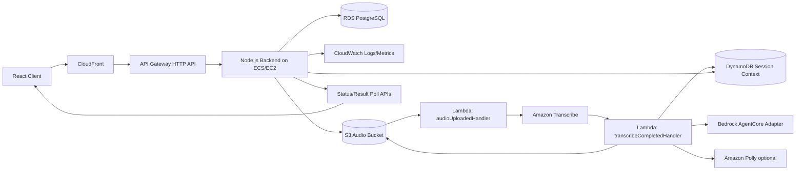

# swd392_team7_product

Hệ thống thi vấn đáp thông minh có sử dụng AI.

## Hybrid serverless architecture (production-oriented)

This repository now includes an incremental hybrid AWS architecture implementation that preserves local/offline development using mock adapters while enabling production deployment on AWS.

### High-level mapping to requested architecture



### Added components

- **IaC (Terraform)**: `infrastructure/terraform`
  - VPC + public/private subnets
  - Private RDS PostgreSQL
  - S3 buckets (audio + frontend), encryption, public access block
  - DynamoDB session table (SSE + PITR)
  - Lambda + IAM least privilege policy
  - S3 trigger -> Lambda orchestration
  - API Gateway HTTP API proxying backend runtime URL
  - CloudFront distribution for frontend and `/api/*` routing to API Gateway
  - CloudWatch log groups for API Gateway/ECS

- **Node.js backend**: `backend`
  - Express API with async audio workflow endpoints:
    - `POST /api/audio/upload-url`
    - `POST /api/audio/process`
    - `GET /api/audio/status/:sessionId`
    - `GET /api/audio/result/:sessionId`
  - AWS SDK v3 integration wrappers with environment-driven configuration
  - Local `AWS_MOCK_MODE=true` default to run without AWS credentials
  - Structured logs compatible with CloudWatch ingestion
  - Dockerfile + ECS/EC2-compatible task definition template

- **Lambda orchestration**: `lambda/src/handlers.js`
  - `audioUploadedHandler`: starts Transcribe flow (or mock mode)
  - `transcribeCompletedHandler`: evaluates transcript through Bedrock AgentCore adapter and optional Polly synthesis, persists to DynamoDB context
  - Event contracts documented at `lambda/src/contracts/audio-events.md`
  - Bedrock AgentCore adapter interface with documented mock fallback for environments without direct runtime integration

- **Frontend API client config**: `frontend/src/config/api.js`, `frontend/src/services/audioApi.js`
  - Supports API Gateway base URL in cloud
  - Defaults to local backend URL for local dev

## Environment variables

### Backend (`backend/.env`)

- `PORT` (default `3000`)
- `AWS_REGION` (default `ap-southeast-1`)
- `AWS_MOCK_MODE` (default `true`)
- `AUDIO_BUCKET_NAME`
- `SESSION_TABLE_NAME`
- `AUDIO_LAMBDA_FUNCTION_NAME`
- `TRANSCRIBE_OUTPUT_BUCKET`

### Lambda

- `AWS_REGION`
- `SESSION_TABLE_NAME`
- `ENABLE_POLLY` (`true|false`)
- `AWS_MOCK_MODE` (`true|false`)

## Local development

### Backend

```bash
cd /home/runner/work/swd392_team7_product/swd392_team7_product/backend
npm install
npm test
npm start
```

Default mock mode runs without AWS credentials and returns deterministic workflow results.

## Deployment prerequisites

1. AWS account with permissions for VPC, RDS, S3, DynamoDB, Lambda, API Gateway, CloudFront, IAM, CloudWatch.
2. Build and package Lambda artifact at `infrastructure/dist/audio-orchestrator.zip` before `terraform apply`.
3. Build and publish backend Docker image to ECR.
4. Deploy backend container to ECS/EC2 and set `backend_base_url` in Terraform variables.
5. Configure frontend build output upload to the Terraform-managed frontend S3 bucket.

## Terraform usage

```bash
cd /home/runner/work/swd392_team7_product/swd392_team7_product/infrastructure/terraform
cp terraform.tfvars.example terraform.tfvars
# update terraform.tfvars values
terraform init
terraform plan
terraform apply
```

## Security considerations

- No hardcoded credentials or account-specific IDs in source code.
- S3 buckets enforce server-side encryption and public access block.
- RDS configured in private subnets and not publicly accessible.
- DynamoDB encryption and point-in-time recovery enabled.
- Lambda IAM policy scoped to required S3/DynamoDB actions and logging.
- CloudWatch log groups configured with retention.

## Notes and limitations

- Bedrock AgentCore runtime APIs differ by region/service maturity; current implementation uses a clean provider adapter with mock implementation to avoid unsupported API assumptions.
- Transcribe completion wiring is represented by `transcribeCompletedHandler` and event contract; production can connect this through EventBridge or an additional trigger Lambda depending on operational preference.
- Existing behavior is preserved since the repository previously had no running app components; all additions are incremental and isolated.
